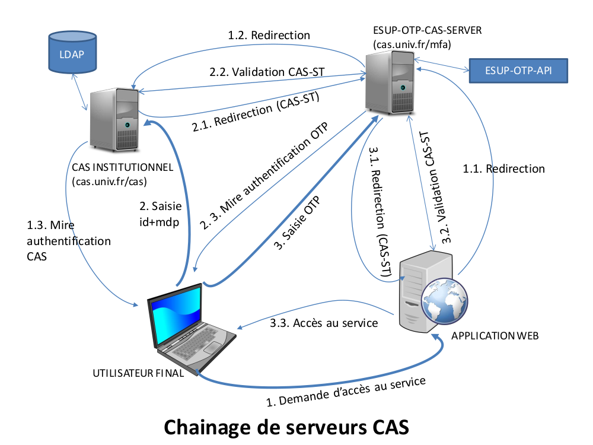

# esup-otp-cas-server

CAS server which delegates to another CAS server the password check + asks for OTP

### Features

- asks for OTP long-term validation (stored in a cookie)
- it can conditionally bypass OTP if the user has not activated any methods
- handle CAS gateway, proxy tickets CAS, CAS SLO back-channel
- handle other CAS server logout (via SLO)
- handle other CAS server session timeout (via shorter session lifetime)

Features not yet implemented
- conditionally limit the allowed methods ==> it can be done into esup-otp-manager


### Drawbacks of esup-otp-cas-server compared to using Apereo CAS MFA (esup-otp-cas)

- each application decides wether it wants MFA or not => you need to watch the logs to know which applications use MFA
- when switching to this CAS in application conf, some users may still force the other CAS, resulting in "unknown ticket" errors. Workaround: redirect to the good CAS:

```
  <LocationMatch "/cas/login(;.*)?">
    Header edit Location "^https://foo[.]univ[.]fr/.*" "https://foo.univ.fr/"
```

### Avantages of esup-otp-cas-server compared to using Apereo CAS MFA (esup-otp-cas)

- Apereo CAS often breaks MFA API, esup-otp-cas needs to be updated for most new Apereo CAS versions
- should work with other CAS servers (Keycloak, LemonLDAP::NG, Shibboleth IDP...)
- `no_otp.if_not_activated_for_user_and` can NOT be implemented in Apereo CAS module esup-otp-cas: it must be done earlier in `cas.authn.mfa.groovy-script.location` (and then you must find a way to known if user has activated OTP, [example](https://www.esup-portail.org/wiki/display/CAS/Retour+de+l%27URN+sur+mise+en+place+de+CAS+6.4.1#Retourdel'URNsurmiseenplacedeCAS6.4.1-MFAviatriggergroovy))
- simple cookie OTP rememberMe vs more complex Apereo CAS UI for "mfa trusted devices"


### Requirements
- [esup-otp-api](https://github.com/EsupPortail/esup-otp-api)

### Installation
- git clone https://github.com/EsupPortail/esup-otp-cas-server
- npm install
- change the fields values in conf.js to your installation
- npm start

### Diagramme d'explication (en français)




License
----

MIT
   [EsupPortail]: <https://www.esup-portail.org/>
